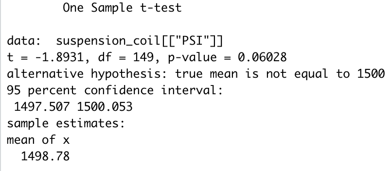
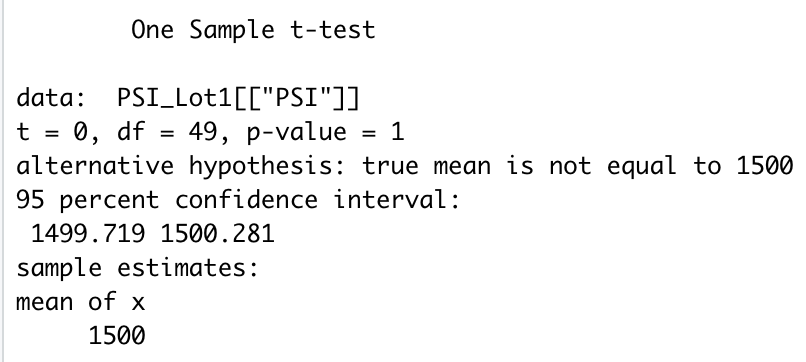
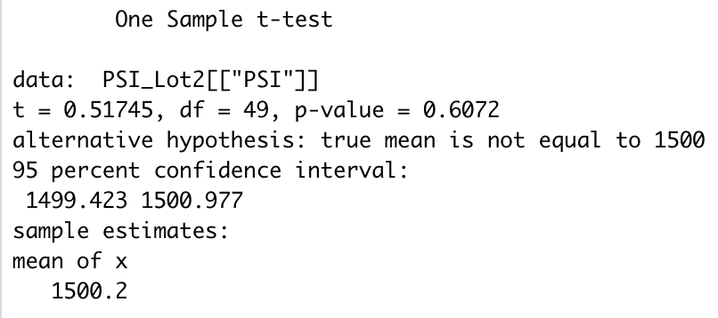
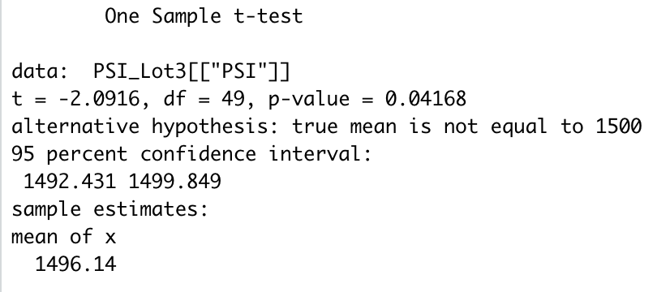

# MechaCar Statistical Analysis
## Linear Regression to Predict MPG

 
#### Which variables/coefficients provided a non-random amount of variance to the mpg values in the dataset?
The variables that provided a non-random amount of variance to the mpg values were vehicle weight and ground clearance. 

#### Is the slope of the liner model considered zero?
The slope of the linear model is not considered zero. We know this because R2 is close to 0.7. If the slop were zero, or around zero, we would expect R2 to be closer to 0, indicating there is no correlation (and therefore no slope) to the independent and dependent variables. 

#### Is this linear regression an effective prediction?
The linear regression does offer a good linear prediction between the dependent and the independent variables. However, given that the intercept is significant, there are likely additional variables that affect MPG that were not included in our linear analysis. 

## Summary Statistics on Suspension Coils
Summary statistics for all lots:
 
 
Summary statistics by lot:
  
 
From these summary statistics we can see that variance for all lots taken together is less than the 100 pounds per square inch maximum. However, looking at the breakdown of summary statistics by lot we can see that Lot 3 has a variance that is above 100 pounds per square inch, meaning Lot 3 does not meet the design specification. 

## T-Tests on Suspension Coils
From the following T-Tests we can conclude that there is not sufficient evidence to reject the null - meaning there is no statistical difference between the lots in total and each lot compared to the general population. 
  T-Test comparing all lots of the population mean:
 
 
T-Tests comparing each lot separately to the population mean:
  
 
  
 
  
 

## Study Design: MechaCar vs Competition
When shopping for a car buyers are looking for and comparing a number of different factors. In order to compare the MechaCar with its' competition we will look at the following metrics:
- cost
- safety rating
- fuel efficiency
- number of seats
  Our null hypothesis is:
There is no difference between cost (safety rating, fuel efficiency, number of seats) of the MechaCar and cost (safety rating, fuel efficiency, number of seats) of the competition.
  Our alternative hypothesis: 
There is a statistical difference between cost (safety rating, fuel efficiency, number of seats) of the MechaCar and cost (safety rating, fuel efficiency, number of seats) of the competition.

  There is quite a lot of data that needs to be gathered to compare the MechaCar to the competition. First we will need to narrow down the competition to just those car manufacturers that make a similar make/model to the MechaCar. Since the goal of the comparison is for the MechaCar to be a top seller while making a substantial profit, it will be easier and more efficient to compare the MechaCar to just the top 5 (based on total sales) car manufacturers. We will need to collect for all 5 top comparable makes/models:
- Base selling price
- Safety rating
- Highway rated fuel efficiency
- City rated fuel efficiency
- Number of seats

  We will then use _____ statistical tests to test our null hypothesis. 
